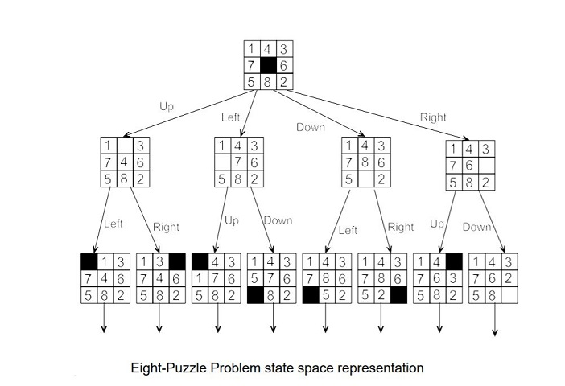

# 8-Puzzle-Problem
Solving 8 puzzle problem in Python

The eight puzzle consists of a 3 x 3 grid with 8 consecutively numbered tiles arranged on it. Any tile adjacent to the space can be moved on it. A number of different goal states are used.
## State space representation:
A state space essentially consists of a set of nodes representing each state of the problem, arcs between nodes representing the legal moves from one state to another, an initial state and a goal state. The state space is searched to find a solution to the problem. Here 0 represents the blank position (space) on the board. 

- In the state space representation of the problem:
  - Nodes of a graph correspond to partial problem solution states.
  - Arcs correspond to steps (application of operators) in a problem solving process 
  - The operators can be thought of in terms of the direction that the blank space effectively moves. i.e. up, down, left, right – The root of the graph corresponds to the initial state of the problem.
  - The goal node is a leaf node which corresponds to a goal state
  
  
  
## A* Search Algorithm: 
It is an informed search algorithm or a best first search meaning that it is formulated in terms of weighted graphs : starting from a specific starting node of a graph, it aims to find a path to the given goal node having the smallest cost (least distance travelled, shortest time, etc.). It does this by maintaining a tree of paths originating at the start node and extending those paths one edge at a time until its termination criterion is satisfied.

At each iteration of its main loop, A* needs to determine which of its paths to extend. It does so based on the cost of the path and an estimate of the cost required to extend the path all the way to the goal. Specifically, A* selects the path that minimizes 

**f(n)=g(n)+h(n)**

Where n is the next node on the path, g(n) is the cost of the path from the start node to n, and h(n) is a heuristic function that estimates the cost of the cheapest path from n to the goal.

Two different examples of admissible heuristics :

**Hamming distance**: The number of Misplaced Tiles 

**Manhattan distance**: The distance between two points measured along axes at right angles.

## Problem Implementation Details
The 8 puzzle is one of the heuristic search problem. The objective of the puzzle is to slide the tiles horizontally or vertically into the spaces until the configuration matches the goal configuration using A* algorithm.
We have used Python Programming Language to implement it.
